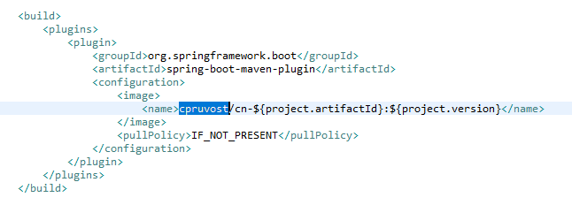
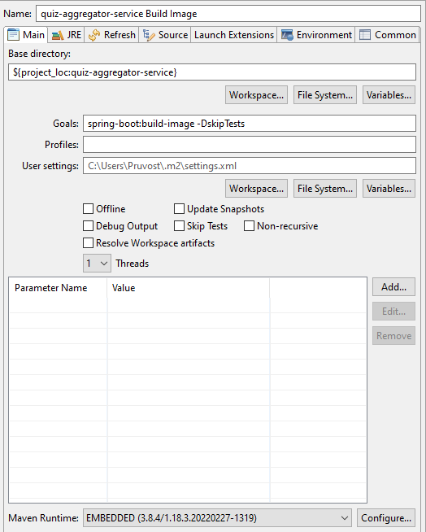
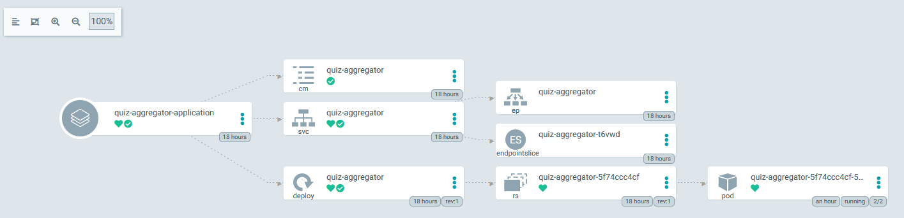
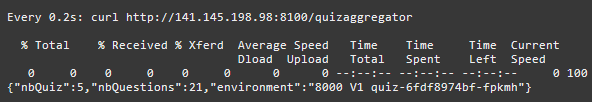
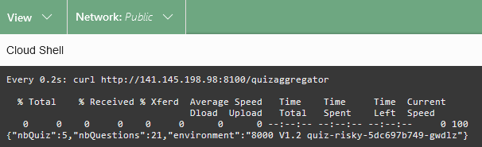

# Quiz Aggregator Service

This is a SpringBoot sample microservice application that focuses calling another microservice called Quiz Service in order to demonstrate the canary release mechanism.

## Prerequisites

You need to have a Database  with a schema (tables, views, ..) ready. So use the project [quiz-db](https://github.com/cpruvost/quiz-db) for that. With this project you have a schema in two versions (V1 and V1POINT2).

You need to have deployed Quiz Service microservices. So use the project [quiz-service](https://github.com/cpruvost/quiz-service) for that. With this project you have 2 version of the microservie (V1 = v1.0.4 and V1.2 = v1.2.0)

You need to have a kubernetes cluster (with istio installed and with argocd) if you want to deploy this microservice on kube.

## Look at the code

Fork the repository https://github.com/cpruvost/quiz-aggregator-service

Looking at the code you will see that we are using the Feign Client to call the microservice Quiz Service. And if you know Jaeger you will see that we propagates all the headers automatically in order to follow the execution time of each service that calls another sevice. 

## Deployment with argocd

You need to install argocd in your kubernestes cluster.

Replace "cpruvost" by your docker hub name in the pom.xml file

Build the docker image using Spring Boot

Push your docker image to your docker registry (docker hub for ex)

Update now the file deployment-quiz-aggregator-application.yaml with your new repository, so update repoURL.

Update now the file deployment-quiz-aggregator.yaml with your docker image.

Deploy the argocd application to your kubernetes cluster : kubectl apply -f deployment-quiz-aggregator-application.yaml

Check that all is good in the argocd console

## Test Quiz Aggregator Service

Look at the Load Balancer Public IP of the service for quiz Aggregator in kubernetes (kubectl get svc)

Launch the Cloud shell in the OCI console and run : watch -n 0.2 curl http://ipadressLB:8100/quizaggregator 

Then 90/100 you get V1 Quiz Service

And 10/100 you get V1.2 Quiz Service

